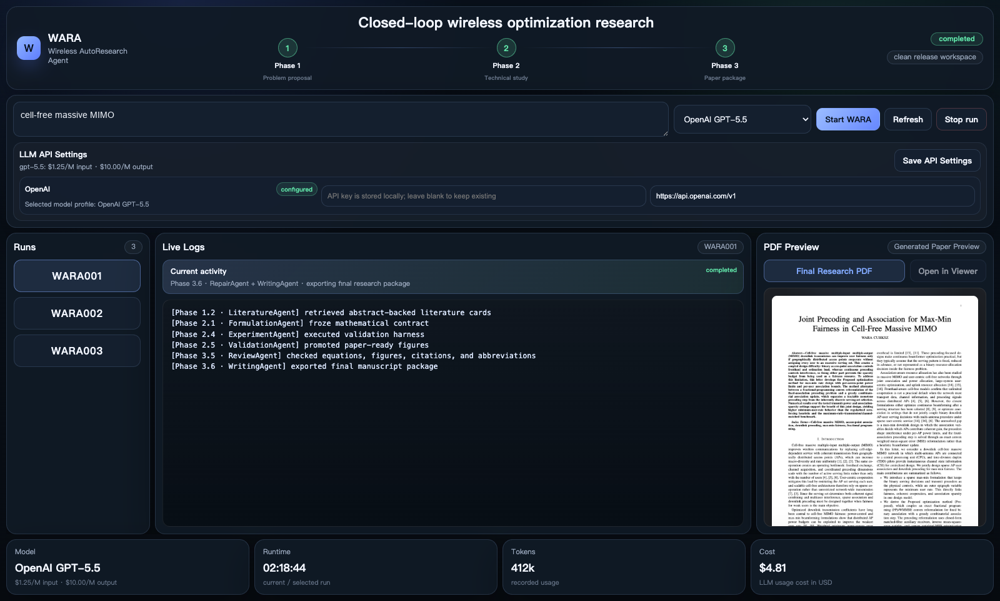

# WARA

[English](README.md) | [中文](README.zh-CN.md)

WARA，即 Wireless AutoResearch Agent，是一个面向无线优化论文的闭环自动研究工作区。它将一个宽泛的无线研究主题逐步转化为可追踪的研究包：文献支撑的问题提出、优化模型、求解路线、可执行实验、验证后的数值证据，以及经过审稿式检查和修订的论文包。



## WARA 解决什么问题

无线优化研究不是一次性写作任务。一篇可信的论文需要从研究空白、系统模型、数学问题、算法设计、可执行实验、数值证据到最终论文主张保持一致。WARA 将这条链路组织为由控制器管理的 artifacts，而不是直接从题目一次生成整篇论文。

核心机制包括：

- **三阶段研究流程：** 问题提出、技术构建、论文包生成。
- **Artifact-mediated control：** 每个阶段读取明确输入，并写出供后续阶段复用的结构化 artifact。
- **Frozen contracts：** 已通过 gate 的问题、数学模型、算法路线和验证证据会被冻结，后续阶段不能静默覆盖。
- **Localized repair：** gate 失败时，问题会被路由回负责该 artifact 的 agent，而不是重跑整个流程。
- **独立输出目录：** 每次 run 都写入独立文件夹，便于复现、审查和打包。

## Manuscript Review Agent

Web 控制台还包含一个独立的 **Manuscript Review** 页面，并与论文中的 evaluation setup 对齐。它接收 manuscript PDF，只将 PDF 中抽取出的文本发送给所选 scoring model，并返回两类 rubric-based score：manuscript-level research validity 和 optimization research maturity。这个 scorer 独立于 WARA 三阶段 pipeline，不读取隐藏 run artifacts、TeX 源文件、figures 或 manifests。

## 三阶段流程

| 阶段 | 目标 | 主要产物 |
| --- | --- | --- |
| Phase 1 | 研究空白识别与问题提出 | research frame、文献 evidence pack、候选问题、冻结的问题 handoff |
| Phase 2 | 无线优化建模、算法设计与实验 | 数学 contract、算法 contract、可执行实验包、验证后的结果包 |
| Phase 3 | 研究交付物生成 | 技术章节、完整 manuscript、review report、修订后的 final paper package |

编号约定如下：

- Phase 1 包含 `phase1.1` 到 `phase1.4`。
- Phase 2 包含 `phase2.1` 到 `phase2.5`。
- Phase 3 包含 `phase3.1` 到 `phase3.6`。

更多阶段映射见 [docs/phase_architecture.md](docs/phase_architecture.md)。

## 快速开始

启动本地 Web 控制台：

```bash
python3 scripts/start_wara_ui.py --host 127.0.0.1 --port 8765
```

启动脚本会在需要时创建 `.venv`，安装 `requirements.txt`，并启动 WARA 控制台。随后打开：

```text
http://127.0.0.1:8765
```

如果需要强制重新安装运行依赖：

```bash
python3 scripts/start_wara_ui.py --install --host 127.0.0.1 --port 8765
```

也可以使用命令行运行：

```bash
python3 scripts/start_wara_ui.py --install --host 127.0.0.1 --port 8765
.venv/bin/python run_wara_pipeline.py --help
.venv/bin/python run_wara_pipeline.py --topic "cell-free massive MIMO" --run-id wara001
```

如果没有指定 `--run-id`，顶层 launcher 会自动生成 timestamped run id，并将其传递给三个阶段，保证同一次 run 的产物对齐。

## 模型供应商

WARA 一次使用一个选中的模型 profile。前端只显示一个 API key 输入框，对应当前所选模型的 provider。

当前支持：

- Kimi / Moonshot
- OpenAI
- DeepSeek

复制本地环境模板：

```bash
cp .env.example .env
```

然后只填写需要使用的 key：

```text
KIMI_API_KEY=
OPENAI_API_KEY=
DEEPSEEK_API_KEY=
```

发布包不会包含真实 API key。

## 输出结构

每次 run 都会写入 `outputs/paper_runs/` 下的独立目录：

```text
outputs/paper_runs/
  phase1/<run_id>/
  phase2/<run_id>/
  phase3/<run_id>/
  final_papers/<run_id>/
```

这样 Phase 1、Phase 2、Phase 3 和最终论文包都能通过同一个 `<run_id>` 对齐。

## 仓库结构

```text
phase1/                 研究方向发现与文献 grounding
phase2/                 建模、算法路线、实验与证据验证
phase3/                 写作、引用整合、审稿、修订与导出
wara_core/              共享 agents、LLM profiles、文献工具和打包工具
app/                    本地 WARA Web 控制台
evaluation/             独立 manuscript review agent
scripts/                控制台启动器和后端服务
docs/                   架构说明和展示素材
outputs/                被 git 忽略的运行输出根目录
```
