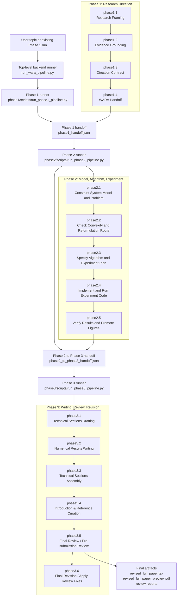

# WARA Backend Pipeline Diagram

This diagram documents the backend-only WARA flow. Runs are launched from CLI entry points and managed by the phase controllers.

## Artifact Boundary

- Phase 1 writes research-direction contracts and the handoff consumed by Phase 2.
- Phase 2 writes the mathematical, algorithmic, validation, and evidence artifacts.
- Phase 3 writes the paper-facing artifacts, review reports, and final revision.
- Runtime outputs are kept under phase run directories and ignored by git.
